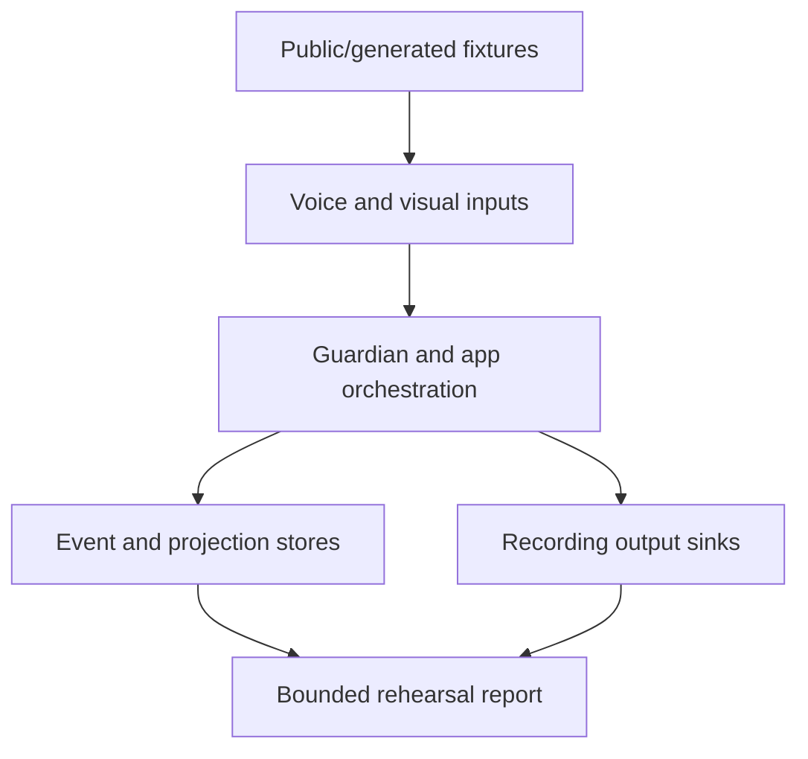

# Offline Application Rehearsal Design

**Date:** 2026-09-02

**Status:** Approved by the owner on 2026-09-02, including the exact empty-bed,
adult-only, face-positive and face-to-outside alert semantics. The dependency-ordered
RED/GREEN plans are published separately; implementation remains paused until an
executor starts with the cross-risk correction plan.

## 1. Problem

Repeated live Voice and camera testing is slow and disruptive. The next safe step is
therefore a software-only application rehearsal that reuses historical aggregate
evidence, tracked public/generated fixtures and deterministic failure injection. One
bundled panoramic real-device test follows only after the software flow is repeatable.

The owner also reports a current visual behavior that the existing eight-scenario suite
does not cover: with no baby in view, the application continuously reports face
covering in addition to outside-bed and adult-entry behavior.

The report is consistent with a reproducible software defect at reviewed head
`c75d9296d9dc920198075578ffc3429ea3400b21`:

- `VisualReview` accepts `baby_visibility=not_visible`,
  `face_visibility=not_visible`, `bed_state=outside_candidate` and `risk=high` in one
  structurally valid review;
- `VisualRiskStateMachine` currently treats `face_visibility=not_visible` plus
  `risk=high` as face-obstruction evidence without first requiring an attributable
  baby in the bed;
- two such reviews ten seconds apart open both `face_not_visible` and
  `outside_candidate` alerts.

This proves that the current software path can create the reported cross-risk false
alert. It does not prove that the live model emitted those exact fields because no
household frame, model prose or private log was captured for this design. The earlier
bounded 50-second no-baby run with zero new risk events is a narrow historical sample,
not evidence that the current reported behavior is absent.

## 2. Goals

The rehearsal must:

1. run the Voice, Guardian, event/projection and output-decision boundaries as one
   ordered application episode without contacting household devices;
2. keep the existing real public/generated video replay as an observational model lane
   and never relabel its output as scene ground truth;
3. prove the no-baby cross-risk invariants before asking the owner for another live
   test;
4. exercise reply lifecycle and notification decisions through recording sinks rather
   than an i9 or Xiaomi speaker;
5. inject bounded failures and repeat the complete software episode to expose state
   leakage, duplicate output and incomplete cleanup;
6. produce one media-free, aggregate-only report that distinguishes current rehearsal
   evidence from historical and real-device evidence;
7. end with a single panoramic real-device checklist, not a sequence of repeated live
   experiments.

## 3. Non-goals and unchanged safety boundaries

This design does not authorize or claim:

- real infant, face-covering, posture, outside-bed or adult-detection accuracy;
- copying household audio, frames, transcripts, model prose, private paths or device
  identifiers into Git or a test report;
- camera, microphone, speaker, PTZ, Xiaomi authentication, CS2 or go2rtc access;
- enabling Camera Reply; `camera_reply_enabled` remains `false` throughout the
  software rehearsal;
- sending real notifications or constructing a Baby Care writer, signer or outbox;
- medication recognition, acknowledgement or write behavior;
- model or threshold tuning, public-corpus READY promotion or baseline promotion;
- PR creation, merge, release, or changes to `main` or `stable/xiaomi-alpha`.

Private historical audio may be replayed later only in ignored owner-private runtime
after separate authority. It is optional corroboration and can never become a required
Git regression fixture.

## 4. Chosen architecture

The accepted `offline-guardian-v1` eight-scenario suite remains unchanged as a component
regression. A new application-rehearsal layer composes existing boundaries and adds no
production device adapter.



The layer has four evidence lanes:

| Lane | Input | Actual boundary exercised | PASS meaning |
|---|---|---|---|
| `historical_ledger` | Existing aggregate checkpoints and exact commit IDs | Provenance reader only | Evidence was classified without being replayed or counted as fresh PASS |
| `visual_observation` | Existing public/generated clips | Current file decode and visual worker | Frames traversed the model pipeline; candidate counts remain observational |
| `application_oracle` | Deterministic semantic reviews, including adversarial combinations | Risk state, event store, projection and recording notification sink | Exact application transitions and side-effect decisions match the declared oracle |
| `voice_application` | Generated mono PCM and fixed ASR fixtures | Wake/action controller, interaction state and recording reply sink | Exact low-risk actions, silence and reply lifecycle match the declared steps |

Visual observation and deterministic application truth remain `INDEPENDENT`. The new
layer joins their timelines and cleanup evidence, not their semantic truth. An actual
model candidate cannot satisfy an oracle expectation, and an oracle event cannot turn
an observational model count into an accuracy PASS.

Rejected alternatives are:

- counting old supervised Voice successes as a new complete matrix;
- committing private household audio so CI can replay it;
- feeding public clip labels into Guardian as if they were model ground truth;
- enabling Camera Reply merely to test the reply state machine;
- suppressing only the face-alert UI while retaining incorrect face evidence in the
  state machine.

## 5. Cross-risk safety contract

Face obstruction is a predicate about an attributable baby subject. Absence of a baby
is not evidence that the baby's face is covered.

### 5.1 Candidate requirements

New `face_not_visible` watch or alert evidence requires all of:

- `baby_visibility` is `visible` or `partial`;
- `bed_state=inside`;
- `face_visibility=not_visible`;
- `image_quality=usable`;
- `risk=high` and confidence meets the existing minimum;
- two qualifying observations meet the existing confirmation interval before an alert.

`adult_presence=present` alone never supplies face-obstruction evidence. A raw semantic
review that says the baby is not visible while the face is not visible must increment a
bounded semantic-conflict counter, but it must not start or extend a face watch/alert.
The outside/adult evidence in the same review remains independently eligible.

The implementation must preserve the structurally valid raw review for bounded
diagnostics, then derive canonical Guardian evidence from it. It must not reject the
whole review and thereby discard independently valid outside/adult evidence. Both the
canonical evidence mapper and direct state-machine entry enforce the same face
predicate, so bypassing one layer cannot restore the defect. Prompt wording is advisory
only.

### 5.2 Existing face state when the baby leaves

One missing-baby frame must not close an existing face alert. Two usable,
minimum-confidence observations meeting the current confirmation interval and agreeing
on `baby_visibility=not_visible` plus `bed_state=outside_candidate` make the face risk
inapplicable:

- candidate evidence is cleared;
- a face `WATCH` is cleared;
- a face `ALERT` completes through the existing recovery lifecycle;
- the outside track owns the continuing safety signal;
- the transition and report record a closed `subject_outside` resolution cause so
  recovery is not misrepresented as proof that the face became clear;
- a `subject_outside` face recovery has `notify=false`; only the independently
  qualifying outside transition may request a notification.

The transition contract adds an optional closed resolution cause:

```text
resolution_cause = explicit_safe | subject_outside | null
```

Existing explicit-clear face recovery retains its current notification behavior and
uses `explicit_safe`. Non-resolution transitions use `null`; `WATCH_CLEARED` and
`RECOVERED` are the only resolution transitions that carry a cause. The field is
bounded event evidence, not free text.

If baby visibility or bed state is uncertain, the system must not create new face
evidence and must not claim an outside-based face recovery. It remains fail closed with
an uncertainty/health observation rather than inventing a specific risk.

### 5.3 Required truth table

| Scene semantics | Face watch/alert | Outside watch/alert | Adult intervention |
|---|---:|---:|---:|
| Baby inside, face clear, no adult | 0 | 0 | 0 |
| Baby inside, face not visible, no adult | exact face lifecycle | 0 | 0 |
| Baby not visible, bed outside, no adult | 0 | exact outside lifecycle | 0 |
| Baby not visible, bed outside, adult present | 0 | exact outside lifecycle | one bounded intervention transition |
| Baby/bed uncertain | 0 new face evidence | 0 unless outside evidence independently qualifies | according to actual adult edge only |

This table is enforced at the evidence boundary and state-machine boundary. Prompt
wording may reduce inconsistent model output but is never the safety mechanism.

## 6. Exact rehearsal scenario pack

The new pack is versioned separately from the fixed eight-scenario suite. Every
scenario has a fresh state store, fixed clock and exact expected counters.

### 6.1 Visual and Guardian application scenarios

1. `APP-SAFE-SLEEP-01`: baby inside and face clear; no visual risk event or recording
   notification.
2. `APP-FACE-OCCLUSION-01`: baby attributable inside the bed and face not visible;
   exact watch, alert, deduplication and recovery for face only.
3. `APP-EMPTY-BED-01`: two high-confidence empty-bed reviews; exact outside lifecycle,
   zero face watch/alert/event/notification and zero adult transition.
4. `APP-ADULT-ONLY-01`: no baby, outside bed and adult-entry edge; exact outside
   lifecycle plus one non-notifying adult-intervention transition, with zero face
   watch/alert/event/notification.
5. `APP-CROSS-RISK-LEGACY-01`: the exact currently accepted inconsistent combination
   (`baby not visible`, `face not visible`, `outside`, `high`); one semantic-conflict
   count, outside lifecycle only and zero face output.
6. `APP-FACE-TO-OUTSIDE-01`: an already open face alert followed by stable confirmed
   outside/no-baby evidence; exact face resolution with `subject_outside` cause plus one
   continuing outside alert and no duplicate notification.

The face-positive control is mandatory. A change that obtains zero false face alerts by
disabling all face alerts fails the pack.

### 6.2 Voice and reply scenarios

Three exact scenarios, `APP-VOICE-FEEDING-01`, `APP-VOICE-DIAPER-01` and
`APP-VOICE-BURPING-01`, cover Feeding, diaper start/complete and burping start/complete
through the current exact-action controller. Every step compares the exact action code,
match kind, interaction transition and recording reply lifecycle. They also cover:

- one legal cross-action command, classified as its own action;
- one ambiguous multi-action command, kept silent;
- one exact action without a wake, kept silent;
- one ASR no-match and one synthetic source failure, both fail closed;
- recording reply sink success, timeout and failure without duplicate completion;
- cleanup after every success, silence, timeout and exception.

The recording reply sink stores only closed codes, byte counts and lifecycle counters.
It never stores synthesized audio or enables a real output adapter.

### 6.3 Joined application episodes

Exactly three episodes interleave a visual semantic timeline with each low-risk Voice
domain:

- `APP-JOINED-FEEDING-SAFE-01`;
- `APP-JOINED-DIAPER-ADULT-ONLY-01`;
- `APP-JOINED-BURPING-FACE-TO-OUTSIDE-01`.

They prove that:

- visual frame/timeline progress continues while a Voice interaction and reply lifecycle
  run;
- the same event ID, reply ID or session state is not reused across lanes;
- a Voice failure cannot create, recover or duplicate a Guardian event;
- a visual failure cannot acknowledge an action or leave a reply session open;
- no Baby Care or real notification boundary is initialized.

This is orchestration evidence, not real shared-camera concurrency evidence. The new
application pack therefore has exactly twelve functional scenarios: six visual/
Guardian application scenarios, three Voice application scenarios and three joined
episodes. The imported `offline-guardian-v1` result and historical ledger are separate
prerequisites and do not inflate that total.

## 7. Historical evidence ledger

The ledger is an immutable, media-free input that names exact repository checkpoints
and classifies their claims. It may record facts such as an action having reached an
adult-audible output at least once or a prior V3E having failed closed. It may not record
transcripts, paths, device IDs or recreate missing denominators.

Every item has:

```text
evidence_id
source_commit
observed_at
scope
result = PASS | FAIL | PARTIAL | NOT_PROVEN
fresh_for_this_run = false
```

Historical items are displayed in a separate report section and are excluded from
scenario totals. The fresh rehearsal can pass even when a live action remains
`NOT_PROVEN`; it cannot publish Feeding, diaper or burping as real-device PASS.

## 8. Fault injection and repetition

Faults are injected only through explicit test doubles at the boundary being tested.
The fixed set covers:

- visual decode/worker failure and malformed semantic review;
- semantic conflict: face absent because the baby is absent;
- duplicate review and non-monotonic/repeated delivery;
- Voice no-match, no-wake and ambiguous multi-action input;
- recording reply timeout, failure and cleanup failure;
- event/projection write failure and report-publication failure.

Each fault retains the first stable failure, leaves no fabricated PASS, performs bounded
cleanup and does not stop an independent sibling lane from reporting its own result.

The deterministic gate is:

- one full scenario pack with exact per-step assertions;
- ten consecutive complete application rehearsals from fresh roots;
- fifty lightweight cross-risk state-machine repetitions from fresh instances;
- zero unexpected face outputs in every no-baby scenario;
- zero duplicate event/reply IDs and zero residual reply sessions;
- identical bounded result counters and report digests across equivalent successful
  runs, excluding declared run ID and timestamps.

These quotas are software stability evidence only. They do not replace the panoramic
real-device test.

## 9. Report contract

The ignored report remains below a mode-`0700` root with mode-`0600` JSON/HTML files.
It contains only closed enums, exact counts, durations, public fixture IDs, test
scenario IDs and commit/digest provenance. It contains no media, transcript, model
prose, exception text, URL, host, address, token or private path.

Mandatory zero-valued fields include:

```text
side_effect.camera_access
side_effect.camera_reply_enabled
side_effect.ptz_commands
side_effect.real_notifications
side_effect.baby_care_writes
side_effect.private_media_reads
visual.no_baby_face_watch
visual.no_baby_face_alert
visual.no_baby_face_event
visual.no_baby_face_notification
voice.residual_reply_sessions
```

The report distinguishes `HISTORICAL`, `SOFTWARE_REHEARSAL` and `PANORAMIC_DEVICE`
evidence classes. Only the second class exists in this implementation stage.

## 10. Software PASS gate

Software rehearsal PASS requires:

- every required scenario and lane passes with exact counters;
- the three no-baby scenarios produce zero face watch, alert, event and notification;
- the positive face scenario produces its exact face lifecycle;
- existing face state is resolved only after confirmed outside/no-baby evidence and the
  resolution cause is explicit;
- Feeding, diaper and burping generated flows have exact action and reply lifecycles;
- all injected failures fail closed with bounded cleanup;
- repetition quotas pass with no state leakage or duplicate output;
- the original `offline-guardian-v1` suite remains green and unchanged;
- no forbidden adapter or private input is initialized.

A software PASS means the application control flow is ready for one bundled panoramic
test. It does not change the current `NOT_PROVEN` live Voice decisions, visual corpus
`PARTIAL`, Camera Reply false state or production release state.

## 11. Panoramic real-device gate after software closure

The software report produces a checklist but does not execute it. A later, separately
authorized owner-supervised run on the logged-in i9 bundles the remaining evidence into
one session:

1. prove one Xiaomi producer, `transport=auto`, advancing video/audio and healthy idle
   workers;
2. keep Camera Reply false while running the low-risk Voice positive/negative matrix;
3. observe empty-bed, adult-only and positive face-control semantics without persisting
   household media or prose;
4. if and only if separately authorized, run the complete Camera Reply V3E from fresh
   counters and restore the flag to false before reporting;
5. publish Feeding, diaper and burping decisions independently, and publish visual and
   Camera Reply results as separate gates.

Any miss, false accept, false face alert, camera movement, producer replacement,
truncation, duplicate output, unexpected write or residual session fails the applicable
gate. One subsystem PASS cannot mask another subsystem failure.

## 12. Execution-order amendment

This design inserts a software-only rehearsal before the remaining live Stage 2 Step 3
matrix:

1. owner approval of this exact specification (complete on 2026-09-02);
2. write and review two dependency-ordered RED/GREEN plans: first the visual cross-risk
   correction, then the offline application rehearsal;
3. execute the cross-risk correction and prove its actual store/query path;
4. only after that gate passes, implement the application rehearsal in small focused
   commits;
5. run the fixed software pack, fault injections and repetition quotas;
6. independently review the diff and report;
7. only then request authority for one bundled panoramic real-device gate.

The implementation handoff is:

- `docs/superpowers/plans/2026-09-02-visual-cross-risk-correction.md`;
- `docs/superpowers/plans/2026-09-02-offline-application-rehearsal.md`.

Do not resume repeated live Voice tests, enter Camera Reply Stage 3, capture household
media or run a panoramic test merely because this design document is committed.
